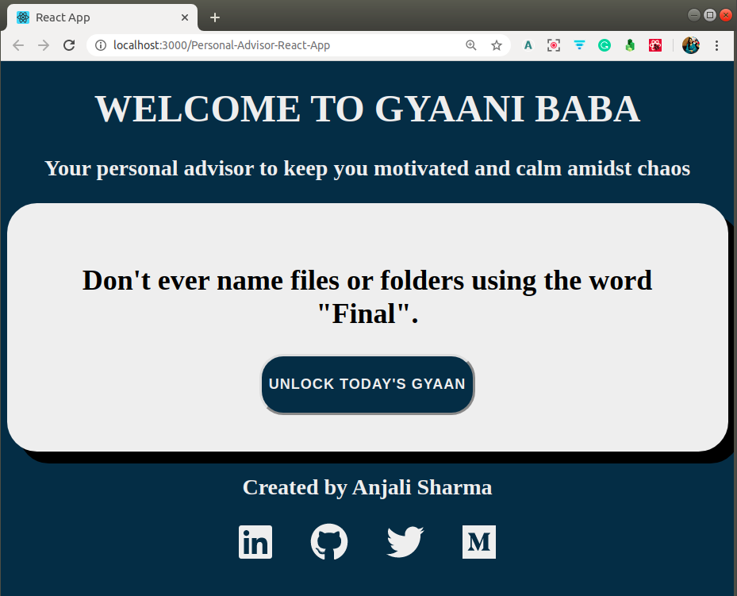

# Personal Advisor React App

   

A personal advisor app to keep you motivated and calm amidst chaos. It is a React web app fetching data from an external API to present data in the form of Advice.

## Screenshot of the Web App

## Tutorial Blog Post

### Introduction and Building a web app

The following is my tutorial blog post on ["Learn React by building an App — React Functionalities Explained"](https://medium.com/mobile-web-dev/learn-react-by-building-a-to-do-app-react-functionalities-explained-74f466e9396). Follow the instructions, fork this repo and build your web app.

### Deploying the web app to Github Pages

The following is my tutorial blog post on ["How to build and deploy a React app to Github pages in less than 5 minutes"](https://medium.com/@anjalisharmaaa/how-to-build-and-deploy-a-react-app-to-github-pages-in-less-than-5-minutes-d6c4ffd30f14). Follow the instructions, build your web app and deploy it to make a great website out of it.

## Project Admin

 

|  |
| :----------------------------------------------------------: |
| **[Anjali Sharma](https://www.linkedin.com/in/anjalisharmaaa/)**  |

  

